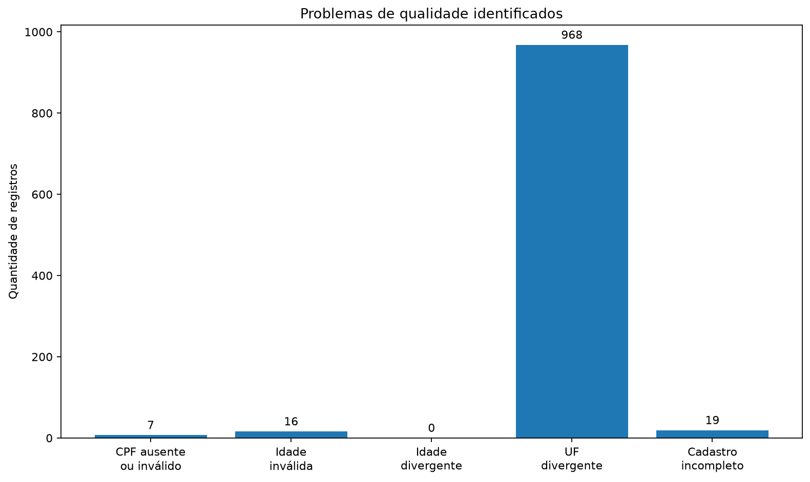
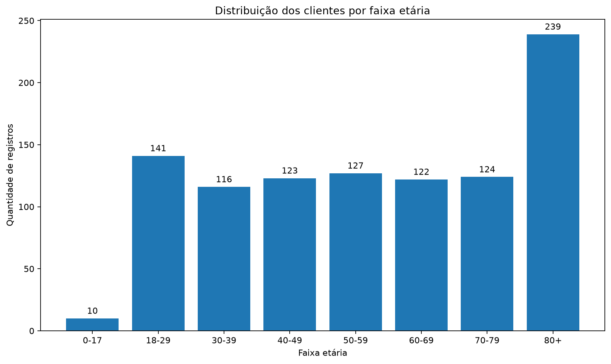

# Relatório de Qualidade dos Dados

## Visão geral

Este relatório apresenta os resultados agregados do pipeline de
diagnóstico, limpeza, validação e anonimização da base cadastral de
clientes.

Nenhum nome, CPF, endereço ou data de nascimento é apresentado neste
relatório.

## Resultados do pipeline

| Indicador | Resultado |
|---|---:|
| Registros recebidos | 1027 |
| Registros após a limpeza | 1018 |
| Duplicidades removidas | 9 |
| Valores nulos na base original | 30 |
| Linhas originalmente incompletas | 29 |
| CPFs ausentes ou inválidos | 7 |
| Idades fora do intervalo permitido | 16 |
| Idades divergentes da data de nascimento | 0 |
| Divergências entre estado e UF do endereço | 968 |
| Cadastros incompletos | 19 |
| Registros com alguma inconsistência | 971 |
| Registros sem inconsistências identificadas | 47 |
| Taxa de consistência | 4.62% |

## Problemas identificados

## Distribuição por faixa etária

## Principais conclusões

- Foram removidos registros completamente duplicados.
- Valores de idade fora do intervalo de 0 a 120 anos foram sinalizados.
- Os CPFs foram preservados como texto e tiveram os dígitos verificadores validados.
- A idade foi recalculada usando 4 de abril de 2024 como data de referência da base.
- Divergências entre o estado informado e a UF do endereço foram registradas para auditoria.
- Nenhuma divergência geográfica foi corrigida automaticamente, pois não é possível determinar qual fonte é a correta sem validação externa.
- Foi criada uma amostra anonimizada para demonstração pública.

## Privacidade

Os arquivos originais e processados permanecem fora do controle de
versão. Somente informações agregadas e uma amostra sem dados pessoais
são disponibilizadas publicamente.

[Acessar a amostra anonimizada](../data/sample/clientes_demo.csv)
